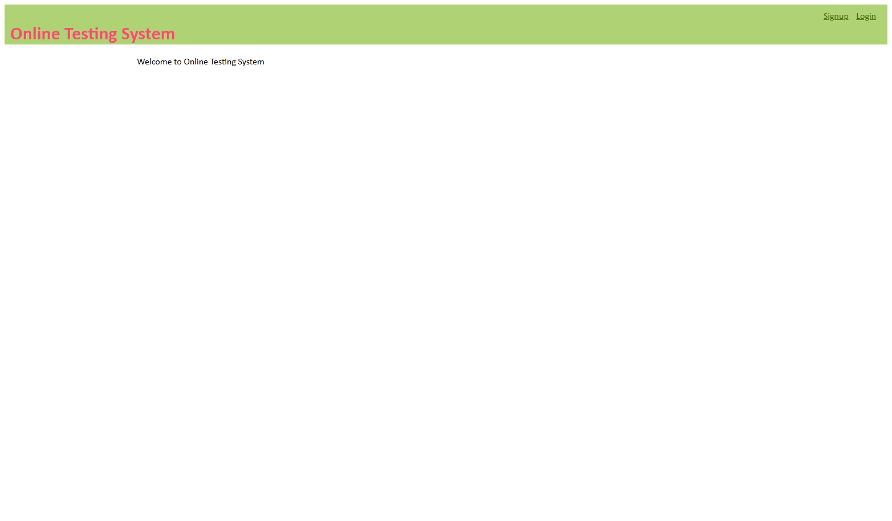
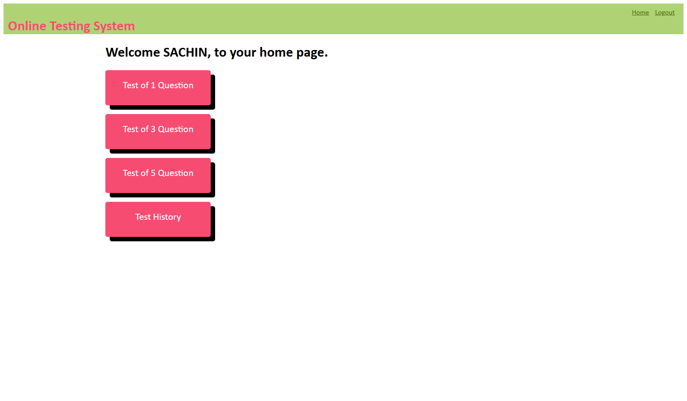
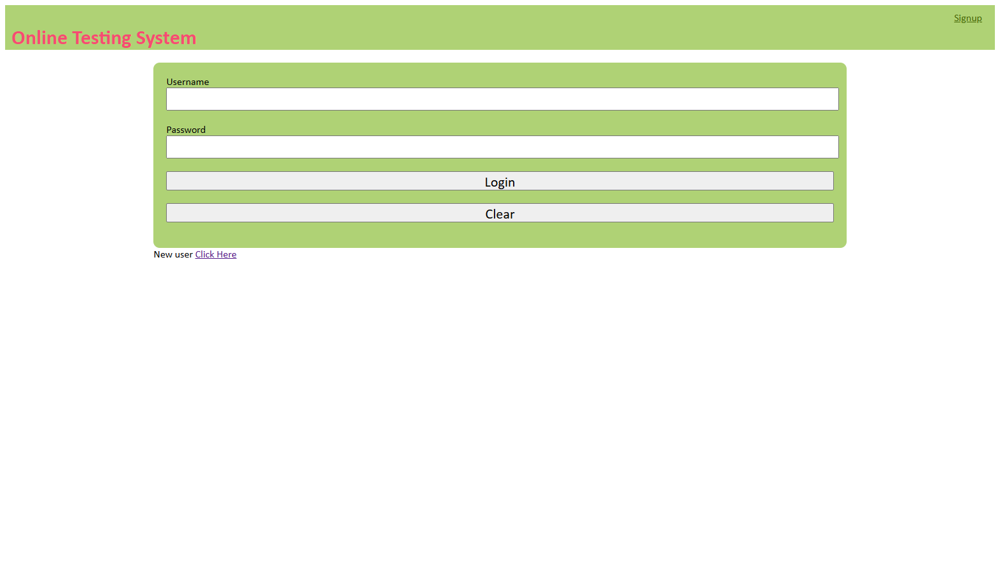
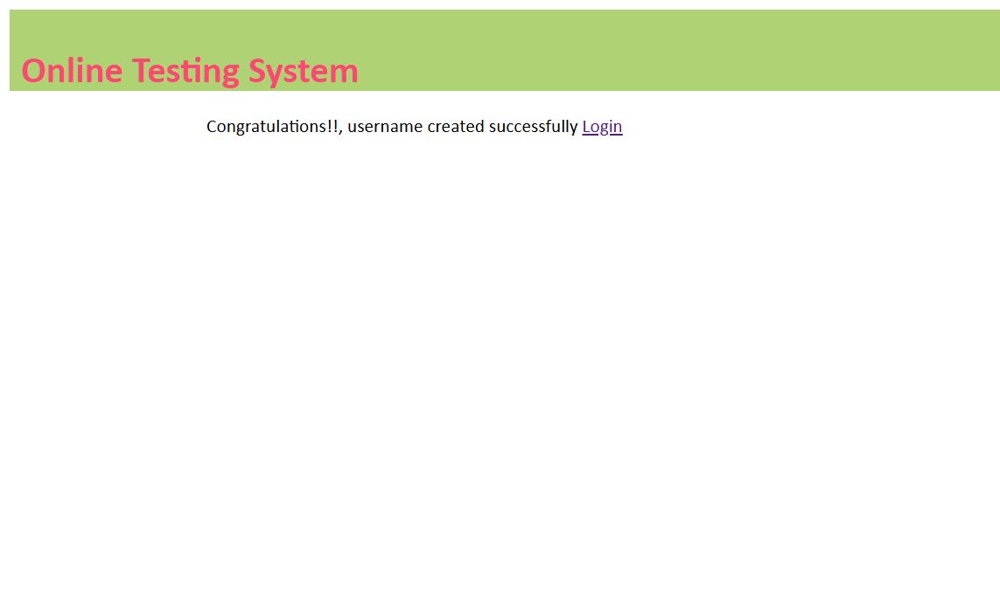
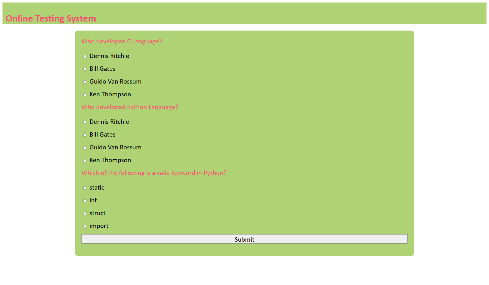
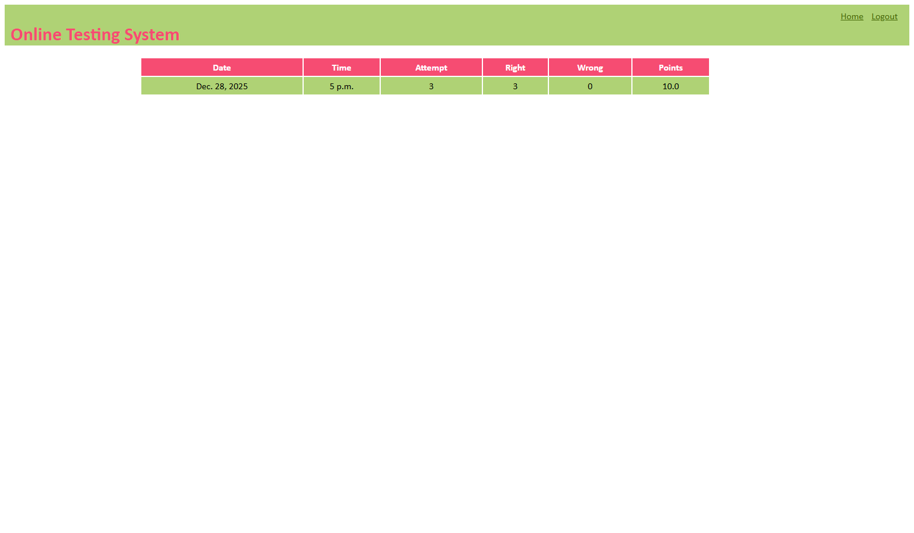
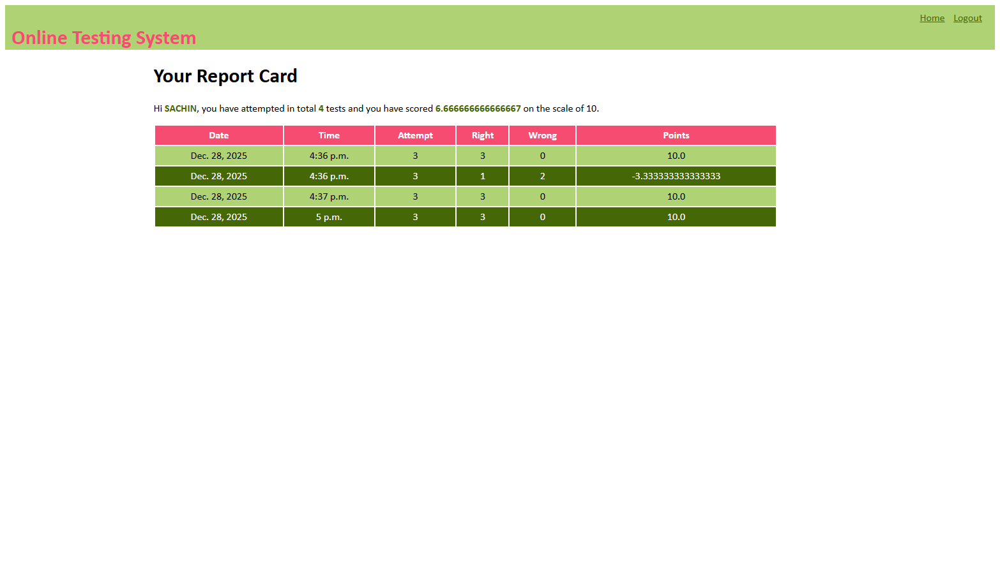

# 🧠 Online Testing System (OTS)

A **web-based Online Testing System** built using **Django**, where candidates can register, log in, attempt tests, view results, and track their test history — all in a clean and simple UI.

---

## 🚀 Features

### 👤 Candidate Management

* Candidate registration
* Secure login using session-based authentication
* Logout functionality

### 📝 Online Tests

* Randomized questions for every test
* Multiple test sizes (1, 3, or 5 questions)
* Auto-calculated score based on correct and incorrect answers

### 📊 Results & History

* Instant result display after test submission
* Candidate test history with:

  * Date & time
  * Attempts
  * Right/Wrong answers
  * Score (out of 10)
* Average score tracking per candidate

### 🎨 UI & Styling

* Reusable base template (`main.html`)
* Clean CSS styling


---

## 🛠️ Tech Stack

| Technology           | Usage                     |
| -------------------- | ------------------------- |
| **Python 3**         | Core programming language |
| **Django 6.0**       | Backend web framework     |
| **SQLite**           | Default database          |
| **HTML + CSS**       | Frontend                  |
| **Django Templates** | Server-side rendering     |
| **Sessions**         | Authentication handling   |

---

## 📂 Project Structure

```
myproject/
├── manage.py
├── requirements.txt
├── db.sqlite3
├── screen_shots/
│   └── OTS_home.png
├── OTS/
│   ├── migrations/
│   ├── static/
│   ├── templates/
│   ├── models.py
│   ├── views.py
│   ├── urls.py
│   └── admin.py
└── myproject/
    ├── settings.py
    ├── urls.py
    ├── wsgi.py
    └── asgi.py
```

---

## 🗄️ Database Models

### 📌 Candidate

* `username` (Primary Key)
* `password`
* `name`
* `test_attempted`
* `points` (Average score)

### 📌 Question

* Question text
* Multiple choice options (A–D)
* Correct answer

### 📌 Result

* Candidate reference
* Date & time
* Attempted questions
* Right / Wrong answers
* Calculated points

---

## 🔄 Application Flow

1. **Welcome Page**

   * Signup or Login

2. **Candidate Registration**

   * New users create an account

3. **Login**

   * Session-based authentication

4. **Home Dashboard**

   * Choose test size
   * View test history

5. **Test Page**

   * Random questions loaded
   * Answer MCQs

6. **Result Calculation**

   * Auto evaluation
   * Score stored in database

7. **Result Display**

   * Latest test result shown

8. **History Page**

   * Complete performance overview

---

## 📸 Screenshots

### Candidate Welcome Page

### 🏠 Candidate Home Page

### Candidate Login Page

### Candidate Signup Page

### Candidate Successful Signup Page

### Candidate Test of 1 Question Page

### Candidate Test of 3 Question Page

### Candidate Test of 5 Question Page

### Candidate Test Result Page

### Candidate Test Result Page


> 📁 Screenshots are stored inside the `screen_shots/` directory.

---

## ⚙️ Installation & Setup

### 1️⃣ Clone the Repository

```bash
git clone <your-repo-url>
cd myproject
```

### 2️⃣ Create Virtual Environment

```bash
python -m venv venv
source venv/bin/activate   # Windows: venv\Scripts\activate
```

### 3️⃣ Install Dependencies

```bash
pip install -r requirements.txt
```

### 4️⃣ Run Migrations

```bash
python manage.py migrate
```

### 5️⃣ Create Superuser (Optional)

```bash
python manage.py createsuperuser
```

### 6️⃣ Start Development Server

```bash
python manage.py runserver 8080
```

Open in browser:

```
http://127.0.0.1:8080/OTS/
```

---

## ⚠️ Important Notes

* Passwords are stored **in plain text** (educational purpose only).

  * 🔐 **Not recommended for production**
  * Use Django’s built-in authentication system for real-world apps
* SQLite is used for simplicity
* Session-based authentication (not JWT)

---

## 🌟 Future Improvements

* Use Django `User` model instead of custom Candidate
* Hash passwords using `make_password`
* Add admin panel for questions
* Add pagination for test history
* REST API using Django REST Framework
* Docker support
* Deployment (Render / Railway)

---

## 📚 Learning Outcomes

This project demonstrates:

* Django MVC (MTV) architecture
* Models, Views, Templates
* URL routing
* Session management
* Form handling
* Database relationships
* Template inheritance
* Static files handling

---

## 👨‍💻 Author

Developed as a **Django learning project** for understanding **full-stack web development with Django**.

---

If you want, next I can:

* 🔐 Refactor this project to **Django Auth**
* 🧪 Add **unit tests**
* 🚀 Prepare **production-ready README**
* 🐳 Dockerize the app
* 🌍 Prepare for deployment

Just tell me 💡
